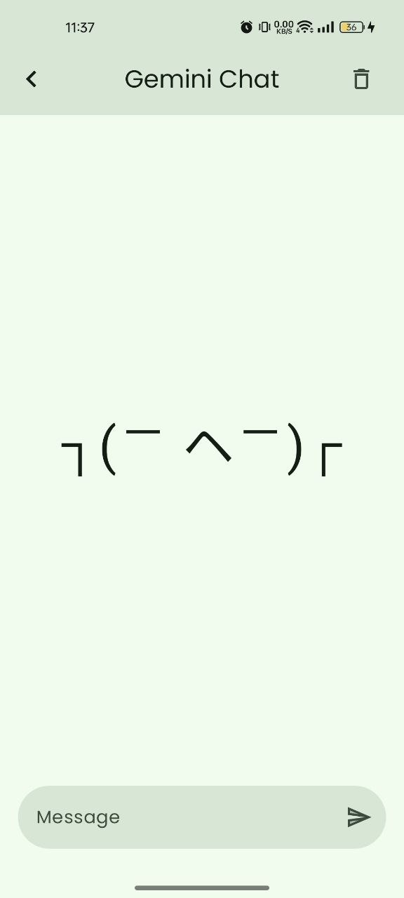
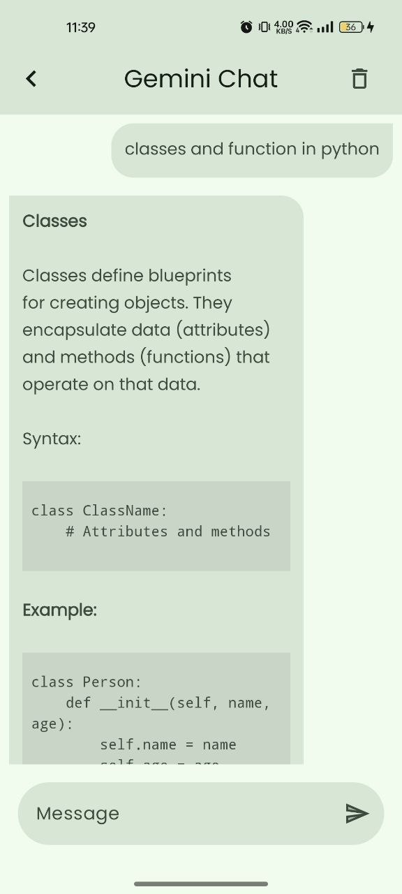
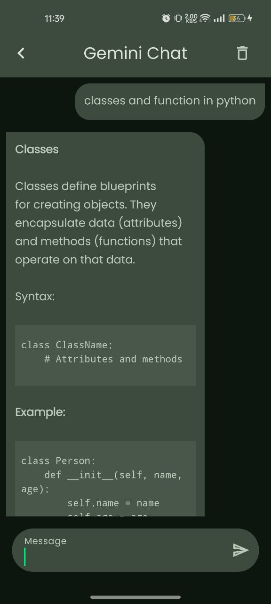

# Gemini-Chat
## Overview
GeminiChat: An AI ChatBot Developed by Gemini SDK Using Jetpack Compose
> Technologies:

- Kotlin
- Clean Architecture
- Jetpack Compose for UI development
- Material Ui

> Libraries 🛠️

- Voyager
- Compose Markdown
- Gemini Client

## Getting Started

> Installation 🛠️

1. Clone this repository:
   ```bash
   git clone https://github.com/imam1912/Gemini-Chat.git
   ```

2. Open in the latest version of Android Studio.
3. Before running the project, obtain an API key from [Google AI](https://ai.google.dev) to communicate with the Gemini
   API.
4. Add the API key in  `Utils` file. Place your API key ```const val API_KEY = "your_api_key"```


## Screenshot

<table>
   <tr>
    <td></td>
    <td></td>
   </tr>
   <tr>
    <td></td>
    <td></td>
   </tr>
</table>

## Show your support

Give a ⭐️ if this project helped you!
